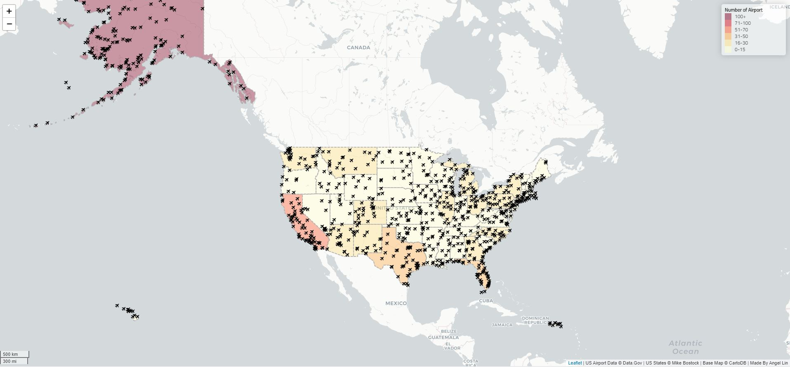

# Web Map of Airports in the United States

The US Airport (2012) map shows all the airports in the United States. The data sources include `airports.geojason` from Data.Gov that contains all the airports in the United States and `us-states.geojason` from Mike Bostock that contains boundaries of and the number of airports in each states.

This interactive map was made using three libraries - `leaflet`, `jQuery`, and `chroma.js`. The popup from clicking on an airport was made using `bindPopup`. And the airport icons (`fa-plane`) on the map was found through `font-awesome`.
